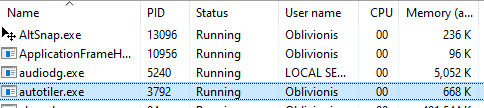

# GlazeWM Autotiler
Written in C++ because i didn't like needing python for autotiling... or Rust to compile gat-gwm.

## Dependencies
- [easywsclient](https://github.com/dhbaird/easywsclient): old but works fine.
- [nlohmann/json](https://github.com/nlohmann/json)