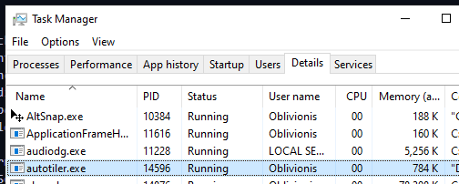
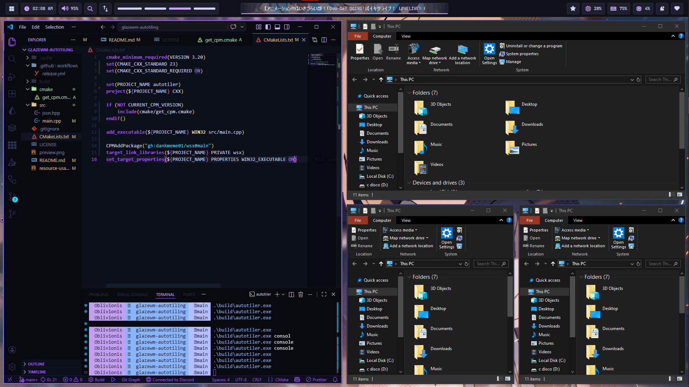

# GlazeWM Autotiler
Written in C++ because i didn't like needing python for autotiling... or Rust to compile gat-gwm.

## Open console
Run the executable with "console" as the argument.

## Dependencies
- [wsx](https://github.com/dankmeme01/wsx) thank you dankmeme
- [nlohmann/json](https://github.com/nlohmann/json)